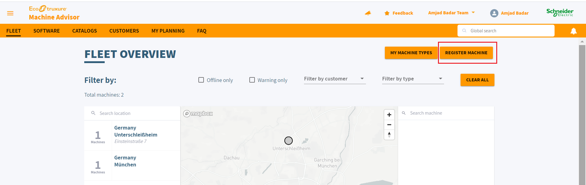
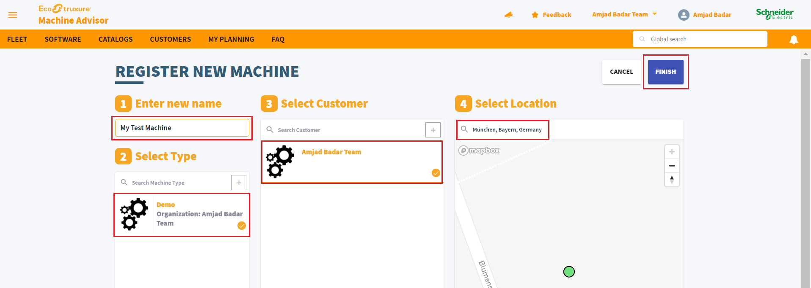
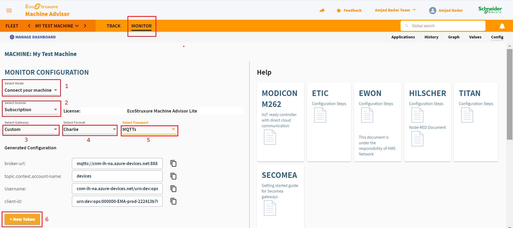
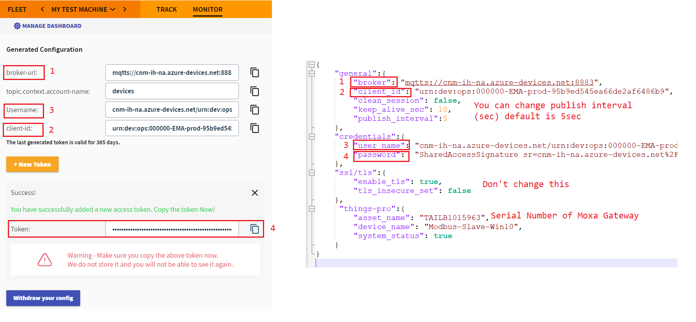
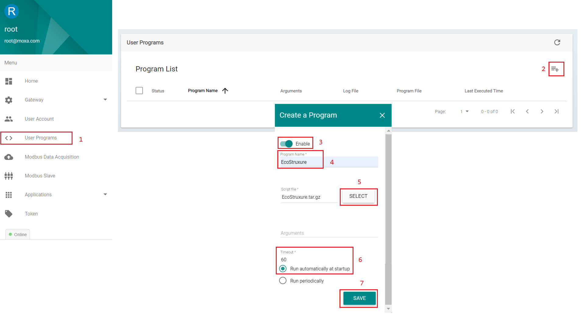
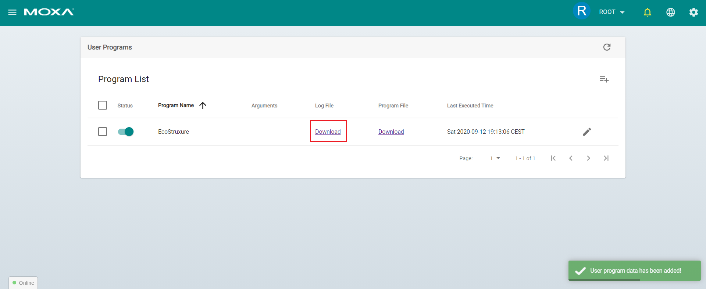
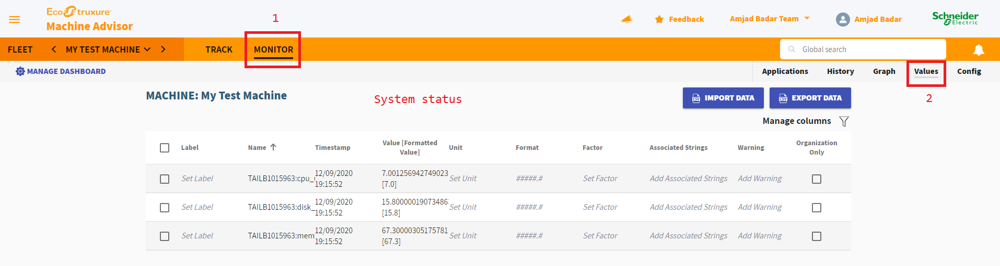

# Moxa Connector Schneider EcoStruxure Machine Advisor

Connecting Modbus devices using Moxa UC-2100 low cost IIoT gateway to Schneider EcoStruxure Machine Advisor

Getting started:

1. Download and Install latest release ThingsPro Gateway software v2.6
2. Configure Modbus Data Template and Connection via ThingsPro Gateway web GUI
3. Register your Machine on SE Machine Advisor and get the broker configuration
4. Modify the config.json file and copy to gateway /home/moxa via file transfer e.g. WinSCP
5. Download EcoStruxure file from Github repository to your laptop and upload it via ThingsPro Gateway web GUI
6. Verifying data on EcoStruxure Machine Advisor

## 1. Download and Install ThingsPro Gateway v2.6 

https://www.moxa.com/en/products/industrial-computing/system-software/thingspro-2#resources

* Download TPG
   

* Installation Manual
   

## 2. Configure Modbus Device Data Template and Connection to your Modbus Slave

   Follow user manual to configure modbus settings for data acquisistion on page 42. 

> Note: This step is not mandatory until unless you want to send modbus data to machine advisor. By default schneider connector sends systems status, which is good starting point to check whether your gateway is sending messages to Ecostruxure. 
      
## 3. Register your Machine on SE Machine Advisor and get the broker configuration

https://www.se.com/ww/en/work/services/field-services/industrial-automation/oem/machine-advisor.jsp

* Register Machine
   
   
* Register New Machine
   
   
* Connect Your Machine
   

## 4. Modify the config.json file and copy to gateway /home/moxa via File transfer e.g. WinSCP
   
   
## 5. Save EcoStruxure file to your laptop and upload it via ThingsPro Gateway web GUI
   
   
   * Verifying the user program
   
   When user program has been added successfully you will see the following output as shown below. 
   
   
   
## 6. Verifying data on Machine Advisor
   
   
   
   
